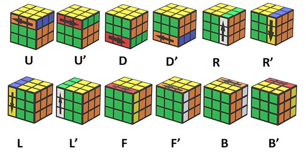

# Rubik's Cube Solver

> **Term Project for CMU 15-112: Fundamentals of Programming (Fall 2024)**
> Completed: December 3, 2024

## About

An interactive Rubik's Cube solver built with CMU Graphics. It automatically solves the cube using the **CFOP method**, applying **Dijkstra's algorithm** at each stage (Cross, F2L, OLL, PLL) to find optimal moves. It also includes a **timer mode** for practicing with a physical cube.

Built entirely from scratch with no external libraries -- only `cmu_graphics` is used.

## Project Structure

| File | Description |
|------|-------------|
| `main.py` | App entry point -- drawing, mouse/key events, `onStep` |
| `functions.py` | Core solving logic and helper functions |
| `Classes.py` | Data structures and classes for the cube |

## Dependencies

No external libraries required. The only dependency is **`cmu_graphics`**, which is bundled with CMU's course environment.

## How to Run

1. Make sure you have Python and `cmu_graphics` installed
2. Run the project:
   ``r
   python main.py
   `  

## Modes

- **Solver Mode** -- Generates a scramble and computes the step-by-step CFOP solution
- **Timer Mode** -- A stopwatch for timing solves with a physical cube

Switch between modes using the **Timer Mode** button at the bottom-right of the screen.

## Customization

In `main.py`, inside the `onAppStartSettings` function, you can adjust:

- **Scramble length** -- number of random moves in the generated scramble
- **Time limit per stage** -- how long (in seconds) the solver spends on each CFOP stage before giving up

## Notes

- Solving can take a while depending on the scramble and time limits set
- Increasing the time limit per stage gives better solutions but takes longer